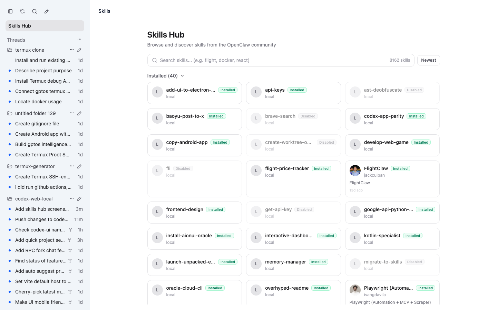
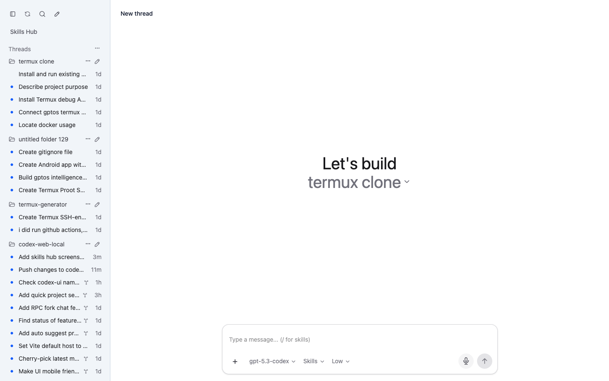
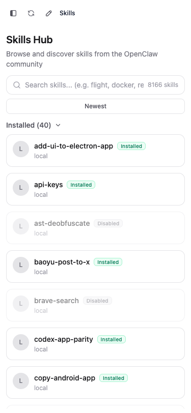
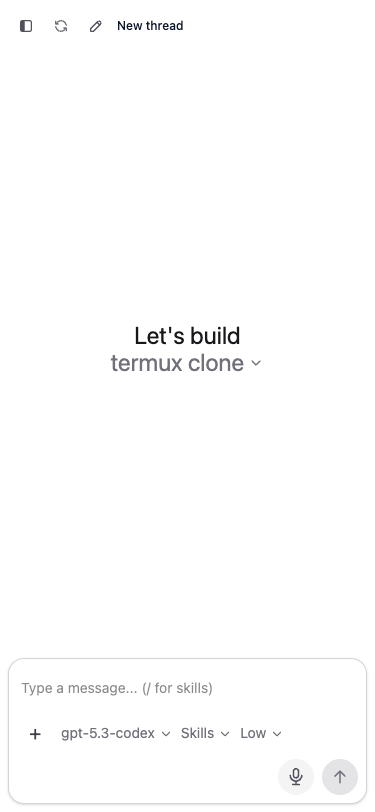

# 🔥 codexapp

### 🚀 Run Codex App UI Anywhere: Linux, Windows, or Termux on Android 🚀

[](https://www.npmjs.com/package/codexapp)
[](#-quick-start)
[](https://nodejs.org/)
[](./LICENSE)

> **Codex UI in your browser. No drama. One command.**
>  
> **Yes, that is your Codex desktop app experience exposed over web UI. Yes, it runs cross-platform.**

```text
 ██████╗ ██████╗ ██████╗ ███████╗██╗  ██╗██╗   ██╗██╗
██╔════╝██╔═══██╗██╔══██╗██╔════╝╚██╗██╔╝██║   ██║██║
██║     ██║   ██║██║  ██║█████╗   ╚███╔╝ ██║   ██║██║
██║     ██║   ██║██║  ██║██╔══╝   ██╔██╗ ██║   ██║██║
╚██████╗╚██████╔╝██████╔╝███████╗██╔╝ ██╗╚██████╔╝██║
 ╚═════╝ ╚═════╝ ╚═════╝ ╚══════╝╚═╝  ╚═╝ ╚═════╝ ╚═╝
```

---


## 🤯 What Is This?
**`codexapp`** is a lightweight bridge that gives you a browser-accessible UI for Codex app-server workflows.

You run one command. It starts a local web server. You open it from your machine, your LAN, or wherever your setup allows.  

**TL;DR 🧠: Codex app UI, unlocked for Linux, Windows, and Termux-powered Android setups.**

---

## ⚡ Quick Start
> **The main event.**

```bash
# 🔓 Run instantly (recommended)
npx codexapp

# 🌐 Then open in browser
# http://localhost:5900
```

If you are using a provider or AI gateway that is already authenticated and do not want `codexapp` to force `codex login` during startup, use:

```bash
npx codexapp --no-login
```

### Linux 🐧
```bash
node -v   # should be 18+
npx codexapp
```

### Windows 🪟 (PowerShell)
```powershell
node -v   # 18+
npx codexapp
```

### Termux (Android) 🤖
```bash
pkg update && pkg upgrade -y
pkg install nodejs -y
npx codexapp
```

Android background requirements:

1. Keep `codexapp` running in the current Termux session (do not close it).
2. In Android settings, disable battery optimization for `Termux`.
3. Keep the persistent Termux notification enabled so Android is less likely to kill it.
4. Optional but recommended in Termux:
```bash
termux-wake-lock
```
5. Open the shown URL in your Android browser. If the app is killed, return to Termux and run `npx codexapp` again.

---

## 🌐 Cloudflared Tunnel

`codexapp` can automatically start a [Cloudflare Tunnel](https://developers.cloudflare.com/cloudflare-one/connections/connect-networks/) so you can reach the UI from any device without opening firewall ports.

### Auto-detection behavior

- If a **Tailscale IP** is detected on your machine, the tunnel is **disabled by default** (Tailscale Serve is a better fit — see section below).
- If no Tailscale IP is detected and you do not pass `--no-tunnel`, a **quick tunnel** is started automatically.
- You can always override with `--tunnel` (force on) or `--no-tunnel` (force off).

### Quick tunnel (temporary public URL)

A quick tunnel gives you a randomly generated `*.trycloudflare.com` URL that is valid only while `codexapp` is running.  
No Cloudflare account required.

```bash
npx codexapp --tunnel
```

On startup you will see:

```
  Tunnel:   https://random-words-here.trycloudflare.com
  Tunnel QR code below
  [QR code printed in terminal]
```

### Named tunnel (stable custom hostname)

For a permanent, stable public URL tied to your own domain, use a named tunnel from the [Cloudflare Zero Trust dashboard](https://one.dash.cloudflare.com/).

1. In the dashboard: **Networks → Tunnels → Create a tunnel** → copy the tunnel token.
2. Configure the public hostname in the dashboard (e.g. `myapp.example.com → localhost:<port>`).
3. Run:

```bash
npx codexapp --tunnel-token <your-tunnel-token>
# Optionally supply the hostname for QR-code display:
npx codexapp --tunnel-token <your-tunnel-token> --tunnel-hostname myapp.example.com
```

Or use environment variables instead of flags:

```bash
export CODEXUI_CLOUDFLARE_TUNNEL_TOKEN="<your-tunnel-token>"
export CODEXUI_CLOUDFLARE_TUNNEL_HOSTNAME="myapp.example.com"   # optional
npx codexapp
```

When a named tunnel connects you will see:

```
[cloudflared] Named tunnel connected. Public hostname is configured in your Cloudflare dashboard.
```

(If `--tunnel-hostname` / `CODEXUI_CLOUDFLARE_TUNNEL_HOSTNAME` is also supplied, a QR code is printed for that hostname.)

### Disabling the tunnel

```bash
npx codexapp --no-tunnel
```

### cloudflared auto-install (Linux)

If `cloudflared` is not found on Linux, `codexapp` will offer to download it automatically to `~/.local/bin/cloudflared` (x64 and arm64 are supported).  
On Windows, install `cloudflared` manually: <https://developers.cloudflare.com/cloudflare-one/connections/connect-networks/downloads/>

---

## iPhone / iPad via Tailscale Serve

If you want to use codexUI from iPhone or iPad Safari, serving it over HTTPS is recommended.

A practical private setup is to run codexUI locally and publish it inside your tailnet with Tailscale Serve:

```powershell
npx codexapp --no-tunnel --port 5900
tailscale serve --bg 5900
```

Then open:

```text
https://<your-machine>.<your-tailnet>.ts.net
```

This setup worked well in practice for:

- iPhone Safari access
- Add to Home Screen
- the built-in dictation / transcription feature in the app
- viewing the same projects and conversations from the Windows host

Notes:

- Tailscale Serve keeps access private to your tailnet
- on iOS, HTTPS / secure context appears to be important for mobile browser access and dictation
- some minor mobile Safari CSS issues may still exist, but they do not prevent normal use
- depending on proxying details, authentication behavior may differ from direct remote access
- if conversations created in the web UI do not immediately appear in the Windows app, restarting the Windows app may refresh them

---

## ✨ Features
> **The payload.**

- 🚀 One-command launch with `npx codexapp`
- 🌍 Cross-platform support for Linux, Windows, and Termux on Android
- 🖥️ Browser-first Codex UI flow on `http://localhost:5900` (default port)
- 🌐 LAN-friendly access from other devices on the same network
- 🧪 Remote/headless-friendly setup for server-based Codex usage
- 🔌 Works with reverse proxies and tunneling setups
- ⚡ No global install required for quick experimentation
- 🎙️ Built-in hold-to-dictate voice input with transcription to composer draft
- 🤖 Optional Telegram bot bridge: send messages to bot, forward into mapped thread, send assistant reply back to Telegram
- 🌐 Cloudflared quick-tunnel (temporary `*.trycloudflare.com` URL) — starts automatically when no Tailscale IP is detected
- 🔐 Named Cloudflare tunnel support via `--tunnel-token` / `CODEXUI_CLOUDFLARE_TUNNEL_TOKEN`
- 🛡️ CSRF protection on all state-mutating endpoints (per-process token)
- 🔒 Filesystem path restriction: file access scoped to the launch project directory (or `$HOME` by default)
- 🔒 Sensitive paths (`.ssh`, `.aws`, `.codex/auth.json`, etc.) are blocked regardless of filesystem root

### Telegram Bot Bridge (Optional)

Set these environment variables before starting `codexapp`:

```bash
export TELEGRAM_BOT_TOKEN="<your-telegram-bot-token>"
export TELEGRAM_ALLOWED_USER_IDS="<your-telegram-user-id>,<optional-second-id>"
export TELEGRAM_DEFAULT_CWD="$PWD" # optional, defaults to current working directory
npx codexapp
```

`TELEGRAM_ALLOWED_USER_IDS` is required for safe access. Only allowlisted Telegram user IDs can use the bridge. If no allowed user IDs are configured, incoming Telegram messages are rejected.

To find your Telegram user ID:

1. Send a message to your bot.
2. Run `curl "https://api.telegram.org/bot<your-telegram-bot-token>/getUpdates"`.
3. Read `message.from.id` from the returned update payload.

Bot commands:

- `/start` show quick help and thread picker
- `/threads` list recent threads and pick one
- `/newthread` create and map a new Codex thread for this Telegram chat
- `/thread <threadId>` map current Telegram chat to an existing thread
- `/current` show currently connected thread for this chat
- `/history` show recent history for current thread
- `/status` show bridge/mapping status
- `/whoami` show your Telegram user/chat IDs and authorization state
- `/help` show command reference

Outgoing assistant messages are sent with Telegram `parse_mode=HTML` for formatting, with automatic plain-text fallback if HTML delivery fails.

---

## 🧩 Recent Product Features (from main commits)
> **Not just launch. Actual UX upgrades.**

- 🛡️ Security hardening: removed password-in-URL auth, dropped Firebase dependency, added CSRF protection on mutating endpoints, filesystem path restriction scoped to launch project / `$HOME`, symlink bypass prevention, sensitive path denylist (`.ssh`, `.aws`, `.codex/auth.json`, …)
- 🌐 Cloudflared quick-tunnel auto-starts when no Tailscale IP is detected (prints URL + QR code)
- 🔐 Named Cloudflare tunnel via `--tunnel-token` / `--tunnel-hostname` flags (or env vars) for stable custom hostnames
- 🗂️ Searchable project picker in new-thread flow
- ➕ "Create Project" button next to "Select folder" with browser prompt
- 📌 New projects get pinned to top automatically
- 🧠 Smart default new-project name suggestion via server-side free-directory scan (`New Project (N)`)
- 🔄 Project order persisted globally to workspace roots state
- 🧵 Optimistic in-progress threads preserved during refresh/poll cycles
- 📱 Mobile drawer sidebar in desktop layout (teleported overlay + swipe-friendly structure)
- 🎛️ Skills Hub mobile-friendly spacing/toolbar layout improvements
- 🪟 Skill detail modal tuned for mobile sheet-style behavior
- 🧪 Skills Hub event typing fix for `SkillCard` select emit compatibility
- 🎙️ Voice dictation flow in composer (`hold to dictate` -> transcribe -> append text)

---

## 🎛️ CLI Flags Reference

| Flag | Default | Description |
|---|---|---|
| `[projectPath]` | — | Project directory to open on launch |
| `--open-project <path>` | — | Add a project to the sidebar without starting the server |
| `-p, --port <port>` | `5900` | Port to listen on (auto-increments if busy) |
| `--password <pass>` | auto-generated | Set a specific password |
| `--no-password` | — | Disable password protection |
| `--tunnel` | auto | Force-enable cloudflared tunnel |
| `--no-tunnel` | — | Disable cloudflared tunnel |
| `--tunnel-token <token>` | — | Named tunnel token from Cloudflare Zero Trust dashboard |
| `--tunnel-hostname <host>` | — | Public hostname for the named tunnel (for QR display) |
| `--open` / `--no-open` | `--open` | Open browser on startup |
| `--login` / `--no-login` | `--login` | Run `codex login` bootstrap if not already authenticated |
| `--sandbox-mode <mode>` | — | `read-only`, `workspace-write`, or `danger-full-access` |
| `--approval-policy <policy>` | — | `untrusted`, `on-failure`, `on-request`, or `never` |

### Environment Variables

| Variable | Description |
|---|---|
| `CODEXUI_CLOUDFLARE_TUNNEL_TOKEN` | Named-tunnel token (same as `--tunnel-token`) |
| `CODEXUI_CLOUDFLARE_TUNNEL_HOSTNAME` | Public hostname for display/QR (same as `--tunnel-hostname`) |
| `CODEX_HOME` | Override Codex home directory (default: `~/.codex`) |
| `TELEGRAM_BOT_TOKEN` | Telegram bot token for the bot bridge |
| `TELEGRAM_ALLOWED_USER_IDS` | Comma-separated allowlisted Telegram user IDs |
| `TELEGRAM_DEFAULT_CWD` | Default working directory for Telegram-initiated threads |

---

## 🌍 What Can You Do With This?

| 🔥 Use Case | 💥 What You Get |
|---|---|
| 💻 Linux workstation | Run Codex UI in browser without depending on desktop shell |
| 🪟 Windows machine | Launch web UI and access from Chrome/Edge quickly |
| 📱 Termux on Android | Start service in Termux and control from mobile browser |
| 🧪 Remote dev box | Keep Codex process on server, view UI from client device |
| 🌐 LAN sharing | Open UI from another device on same network |
| 🧰 Headless workflows | Keep terminal + browser split for productivity |
| 🔌 Custom routing | Put behind reverse proxy/tunnel if needed |
| ⚡ Fast experiments | `npx` run without full global setup |

---

## 🖼️ Screenshots

### Skills Hub


### Chat


### Mobile UI



---

## 🏗️ Architecture

```text
┌─────────────────────────────┐
│  Browser (Desktop/Mobile)   │
└──────────────┬──────────────┘
               │ HTTP/WebSocket
┌──────────────▼──────────────┐
│         codexapp            │
│  (Express + Vue UI bridge)  │
└──────────────┬──────────────┘
               │ RPC/Bridge calls
┌──────────────▼──────────────┐
│      Codex App Server       │
└─────────────────────────────┘
```

---

## 🎯 Requirements
- ✅ Node.js `18+`
- ✅ Codex app-server environment available
- ✅ Browser access to host/port
- ✅ Microphone permission (only for voice dictation)

---

## 🐛 Troubleshooting

| ❌ Problem | ✅ Fix |
|---|---|
| Port already in use | Run on a free port or stop old process |
| `npx` fails | Update npm/node, then retry |
| Termux install fails | `pkg update && pkg upgrade` then reinstall `nodejs` |
| Can’t open from other device | Check firewall, bind address, and LAN routing |
| Tunnel URL never prints | Check if `cloudflared` is installed; run with `--no-tunnel` to skip |
| Named tunnel doesn’t connect | Verify token from Cloudflare Zero Trust dashboard and that the tunnel is active there |
| `cloudflared` install prompt not shown | Non-interactive terminal or already prompted once — install manually from <https://developers.cloudflare.com/cloudflare-one/connections/connect-networks/downloads/> |
| “Path is outside the permitted filesystem root” | File is outside the launch project directory — start with a broader `projectPath` or omit it to default to `$HOME` |
| “Access to this path is not allowed” | Requested path matches the sensitive-path denylist (`.ssh`, `.aws`, `.codex/auth.json`, etc.) — this is intentional |

---

## 🤝 Contributing
Issues and PRs are welcome.  
Bring bug reports, platform notes, and setup improvements.

---

## ⭐ Star This Repo
If you believe Codex UI should be accessible from **any machine, any OS, any screen**, star this project and share it. ⭐

<div align="center">
Built for speed, portability, and a little bit of chaos 😏
</div>

---

Forked from [pavel-voronin/codex-web-local](https://github.com/pavel-voronin/codex-web-local) by Pavel Voronin.
